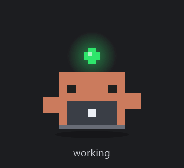
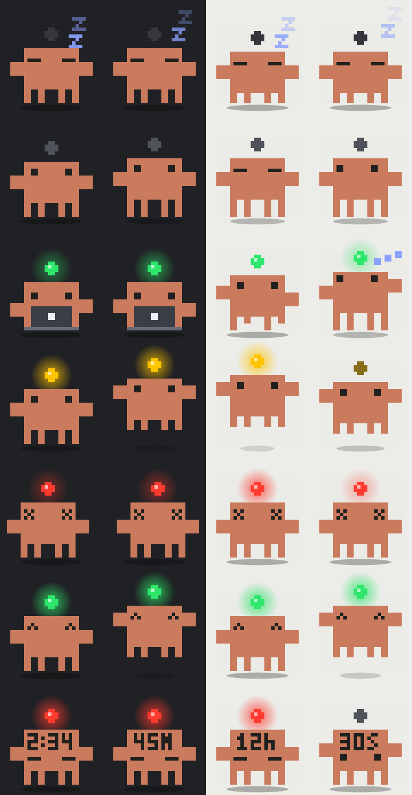

# Claude Buddy



A desktop pet for Windows. The Claude Code pixel mascot sits on top of your desktop,
animates according to what Claude Code is doing, and opens the Claude desktop app when
you click it.

| Light  | Buddy does            | Meaning                                                   |
|--------|-----------------------|-----------------------------------------------------------|
| Green  | types, runs, thinks   | a session is working                                      |
| Yellow | hops, lamp blinks     | a session is waiting on you (permission prompt, question) |
| Red    | shakes, X eyes        | a session's last turn died with an API error (last 30 min)|
| Red    | rests, timer on head  | usage limit hit: countdown to the reset on its forehead   |
| Grey   | breathes, blinks      | sessions are open, all idle                               |
| Off    | sleeps, "z z"         | no sessions running                                       |

If several sessions disagree, the most urgent wins: yellow > red > green > grey > off.

**Usage-limit timer.** When Claude says "You've hit your session limit · resets
3:40am", the buddy shows the time left on its forehead (`2:34` = 2 h 34 min, then
`45m`, then `30s`) until the reset. Clicking the buddy turns the red lamp off but the
countdown stays. Once seen, the limit is remembered until its reset time: deleting the
message, closing the session or restarting the buddy does not lose it. It disappears
early only if Claude answers a later request normally, and it steps aside while a
session is really working. A session that is merely parked until the limit resets
(auto-resume) counts as limited, not as working.

The buddy learns about a limit only when a session runs into it. Until some request
has failed with the limit message, there is nothing on disk to read.

It is one small native `.exe` (about 100 KB, about 40 MB of RAM), written in C# and
compiled with the compiler that already ships inside Windows. Nothing to install, no
admin rights, and it does not touch your Claude settings.

**Windows only.** The window, tray icon, hotkey and autostart are all Win32. A macOS
version would be a separate program.

*Unofficial fan project. Not affiliated with or endorsed by Anthropic. Released under
the MIT license.*

---

## 1. Build it

### What you need

- Windows 10 or 11.
- .NET Framework 4.x. It is part of Windows, so you already have it. The build uses
  `C:\Windows\Microsoft.NET\Framework64\v4.0.30319\csc.exe`.
- PowerShell (any version).

You do **not** need Visual Studio, the .NET SDK, Node or Python.

### Build

From the project folder:

```powershell
powershell -ExecutionPolicy Bypass -File .\build.ps1
```

That does three things:

1. Compiles `src\*.cs` into `bin\ClaudeBuddy.exe`.
2. On the first build, asks the exe to draw its own icon (`assets\buddy.ico`) and then
   compiles again with the icon embedded.
3. Runs the self-tests (`bin\selftest.txt`) and fails the build if any check fails.

Add `-SkipTests` to skip step 3.

If you would rather run the compiler by hand, this is the whole build:

```powershell
& "$env:WINDIR\Microsoft.NET\Framework64\v4.0.30319\csc.exe" /nologo /target:winexe /optimize+ `
  /out:bin\ClaudeBuddy.exe /win32manifest:src\app.manifest /win32icon:assets\buddy.ico `
  /r:System.dll /r:System.Core.dll /r:System.Drawing.dll /r:System.Windows.Forms.dll src\*.cs
```

### Try it without installing

```powershell
.\bin\ClaudeBuddy.exe --dev
```

`--dev` means "this is a test run": it uses a separate config file and never registers
itself to start with Windows. Stop it with right-click > Exit, or:

```powershell
.\bin\ClaudeBuddy.exe --dev --quit
```

To see one state without waiting for Claude to be in it:

```powershell
.\bin\ClaudeBuddy.exe --dev --state Waiting
```

(`Sleep`, `Idle`, `Working`, `Waiting`, `Error`, `Done`.)

---

## 2. Install it so it runs all day

```powershell
powershell -ExecutionPolicy Bypass -File .\install.ps1
```

The script builds, copies `ClaudeBuddy.exe` to `C:\Users\<you>\.claude-buddy`, puts a
**Claude Buddy** shortcut on the Desktop and starts it. Run it again after changing the
code: it stops the running copy and replaces it. Options: `-InstallDir <folder>`,
`-NoShortcut`, `-NoStart`.

By hand, the same thing is: copy `bin\ClaudeBuddy.exe` to a permanent folder and
double-click it. The exe is self-contained.

On a normal (non `--dev`) start the buddy adds itself to
`HKCU\Software\Microsoft\Windows\CurrentVersion\Run`, pointing at wherever the exe is
at that moment. So start it from its final location, not from the build folder. That
registry key is per-user and needs no admin rights.

**Starting it later:** it starts by itself when you sign in. If you exited it, use the
Desktop shortcut. Starting it twice is harmless; the second copy exits immediately.

Its files stay next to the exe: `config.ini` (position, size, options, hotkey) and
`buddy.log` (state changes, capped at 512 KB).

**Uninstall:**

```powershell
powershell -ExecutionPolicy Bypass -File .\uninstall.ps1
```

It stops the buddy and removes the autostart entry, the Desktop shortcut and the
buddy's own files (`ClaudeBuddy.exe`, `config.ini`, `buddy.log`). The install folder
is removed only if that leaves it empty, so nothing else you keep there is touched.
With no arguments it finds the buddy through its autostart entry; if you installed
with `-InstallDir` and switched "Start with Windows" off, pass the same `-InstallDir`.

> **Building from a terminal inside the Claude desktop app?** That app is a Store
> (MSIX) package. Anything it launches gets its writes to `AppData` silently redirected
> into the package's private store, where other programs cannot see them. Put the
> install folder somewhere outside `AppData` (your user folder is fine), and start the
> exe from Explorer rather than from that terminal so it runs as a normal process.

---

## 3. Using it

- **Left click:** opens Claude on the session that most needs you (waiting, then
  errored, then working). If nothing is going on it opens the Code tab. Clicking also
  marks current errors as seen, so the red light goes out.
- **Drag:** move it anywhere. The position is remembered.
- **Right click** (or the tray icon): list of sessions with their state (click one to
  open it), Open Claude Code, Hide buddy, Preview light, Size, Always on top, Keep
  screen awake, Start with Windows, Reset position, Exit.
- **Hover:** a summary such as "1 needs you, 2 working, 3 idle".
- **Hide / show:** `Ctrl+Alt+H` from anywhere, or "Hide buddy" in the menu. Hiding only
  removes the sprite. The tray icon stays, keeps its coloured status dot, and brings
  the buddy back with a left click or "Show buddy".
- **Keep screen awake:** off by default. When ticked, the display does not dim or turn
  off and the PC does not go to sleep by itself while the buddy runs, so the light is
  always visible. Closing the lid or pressing the power button still works. It uses
  more battery. (`keepawake=1` in `config.ini`.)
- **Preview light:** plays any state for six seconds (the whole 18-second rotation for
  green), so you can see yellow, red and the usage-limit timer without waiting for
  Claude to be in that state.

### Changing the hotkey

Exit the buddy, edit the `hotkey=` line in `config.ini` next to the exe, start it
again. Examples: `Ctrl+Alt+H`, `Ctrl+Shift+F9`, `F12`, `none`.

The default is `Ctrl+Alt+H` rather than plain `Ctrl+H` on purpose. The buddy never has
keyboard focus, so its shortcut must be system-wide, and a system-wide `Ctrl+H` would
stop working everywhere else: browser history, find-and-replace in editors, backspace
in terminals. `hotkey=Ctrl+H` is accepted if you want it anyway. If another program
already owns the combination, the buddy says so in `buddy.log` and the menu still
works.

---

## 4. How it works

Five ideas carry the whole thing.

### 4.1 Where the status comes from

Claude Code writes one small JSON file per running session:

```
%USERPROFILE%\.claude\sessions\<pid>.json
```

```json
{ "pid": 39024, "sessionId": "5905dfa1-…", "hostSessionId": "local_2d482964-…",
  "cwd": "C:\\…", "name": "Desktop Claude bot", "procStart": "134353273632667976",
  "status": "busy", "waitingFor": "permission prompt", "statusUpdatedAt": 1790854084986 }
```

`status` is `busy`, `shell`, `idle` or `waiting`. When it is `waiting`, `waitingFor`
says why (`permission prompt`, `input needed`, …). The buddy reads these files once a
second. That is the entire integration: no hooks, no plugin, no edits to
`settings.json`. (`src\Sessions.cs`, `SessionScanner.Scan`.)

Three details make it reliable:

- **Leftover files.** A crashed session leaves its file behind and Windows reuses
  pids. `procStart` is the process creation time (a Windows FILETIME), so the buddy
  only trusts a file if a process with that pid exists *and* started at that time.
- **Helper processes.** The desktop app forks short-lived helpers off a session. They
  write a file too, with the same `hostSessionId` as their parent but no
  `messagingSocketPath`. Those are dropped.
- **Half-written files.** A file caught mid-write fails to parse. The buddy keeps the
  last good reading for that file instead of flickering.

These fields are not a documented API. If a future Claude Code version changes them,
unknown values simply read as "idle".

### 4.2 Where "red" comes from

There is no `error` status. When a turn dies on an API error (rate limit, overloaded,
connection lost), Claude Code appends a synthetic assistant message to the session
transcript:

```
%USERPROFILE%\.claude\projects\<cwd with non-alphanumerics as '-'>\<sessionId>.jsonl
… "type":"assistant", "error":"rate_limit", "isApiErrorMessage":true …
```

When a session is idle, the buddy reads the last 256 KB of its transcript and walks
backwards to the last `user` or `assistant` record. If that record is an API error
less than 30 minutes old and you have not clicked the buddy since, the light is red.
The transcript is only re-read when its size or timestamp changes.
(`src\Sessions.cs`, `Transcript.ReadLastTurn`.)

A usage limit is the same kind of record with `"error":"rate_limit"` and a text such
as `You've hit your session limit · resets 3:40am (Asia/Calcutta)`.
`LimitMessage.ParseReset` pulls the clock time out of that text (it is in the
machine's own time zone) and turns it into the next moment that clock time occurs
after the error. Until then the session stays red and the countdown is drawn on the
forehead in a 3 x 5 pixel font; the eyes move down to make room. The reset time is
kept in memory and in `config.ini` (`limit_reset`, `limit_seen`), so it no longer
depends on the message staying in the transcript. It counts as lifted early if any
session's transcript ends with an ordinary reply whose request was sent after the
limit message. A session whose status is `busy` but whose last record is the limit
message, with no new prompt after it, is parked waiting for the reset and is shown as
limited. Limit messages without a reset time ("out of usage credits") are treated as
ordinary errors.

### 4.3 A window that is only a sprite

`src\BuddyForm.cs` is a WinForms `Form` with four extended window styles:

| Style              | Effect                                             |
|--------------------|----------------------------------------------------|
| `WS_EX_LAYERED`    | per-pixel transparency                             |
| `WS_EX_TOPMOST`    | stays above other windows                          |
| `WS_EX_TOOLWINDOW` | no taskbar button, hidden from Alt+Tab             |
| `WS_EX_NOACTIVATE` | clicking or dragging it never steals keyboard focus|

Nothing is painted the normal way. Each frame is drawn into a 32-bit bitmap and handed
to Windows with `UpdateLayeredWindow`, which is what gives real alpha (the soft glow
around the lamp). Fully transparent pixels let clicks through to whatever is behind;
the bot's rectangle is filled with alpha 1 so the whole bot is clickable.

A frame is only pushed when it differs from the last one, so an idle buddy costs
almost nothing. The topmost flag is re-asserted every second because some apps knock
windows out of the topmost band.

### 4.4 The sprite

`src\Sprite.cs` holds no image file. The mascot is traced from the original, which is
12 x 8 blocks:

```
. . X X X X X X X X . .
. . X o X X X X o X . .      o = eye
X X X X X X X X X X X X
X X X X X X X X X X X X
. . X X X X X X X X . .
. . X X X X X X X X . .
. . X . X . . X . X . .
. . X . X . . X . X . .
```

Each block is 2 x 2 sprite pixels so parts can move by half a block: body 16 x 12,
arms 4 x 4, legs 2 x 4, eyes 2 x 2, plus a 4 x 4 lamp floating above the head, all on
a 30 x 33 grid. Each sprite pixel is drawn as an N x N block of screen pixels (N
depends on the Size setting and the monitor's DPI), which keeps it crisp.

`GetPose(state, tick)` returns the numbers for one frame (body offset, leg lengths,
arm offsets, eye style, prop, lamp colour and glow) and `Render` draws them. The
animation timer ticks every 80 ms:

- **Working:** three acts of six seconds each, in rotation: sitting behind a laptop
  typing (eyes on the screen, arms tapping), running on the spot (alternate leg pairs
  lift, body bobs), and thinking (eyes wander up, one arm raised, dots appear). Green
  glow pulsing on a sine wave throughout.
- **Waiting:** a hop with arms raised, lamp blinking yellow.
- **Error:** a short shake, X eyes, red pulse.
- **Idle:** slow breathing, a blink, an occasional glance.
- **Sleep:** eyes closed, drifting z's.
- **Done:** two quick hops with happy eyes when work finishes.

To restyle it, change the colour constants or the rectangles in `Render`.

Every state, on a dark and a light background (`ClaudeBuddy.exe --render`):



### 4.5 Opening Claude

The Claude desktop app registers `claude://` links. The buddy uses:

- `claude://code/new?source=desktop_action` for the Code tab
- `claude://code/continue?session=local_<id>&source=desktop_action` for one session
  (`local_<id>` is the `hostSessionId` from the state file)

It starts the app through its execution alias,
`%LOCALAPPDATA%\Microsoft\WindowsApps\claude-desktop.exe "<url>"`. The registered
`claude://` handler has the app's version number in its path and can go stale after
an update; the alias does not. If the alias is missing it falls back to opening the
URL directly. (`src\Config.cs`, `Launcher`.)

---

## 5. Project layout

```
build.ps1           build + self-test
install.ps1         build, copy to the install folder, Desktop shortcut, start
uninstall.ps1       stop, remove autostart entry, shortcut and install folder
src\
  Program.cs        entry point, command line, single instance, clean quit
  BuddyForm.cs      the window: drawing, drag, click, menu, tray icon, hide/show
  Sprite.cs         pixel art, animation poses, icon generation
  Sessions.cs       state-file scanner, liveness check, transcript error probe
  Config.cs         config.ini, hotkey parsing, autostart registry key, log, Claude launcher
  MiniJson.cs       small JSON reader (avoids loading System.Web)
  Native.cs         Win32 declarations
  SelfTest.cs       the --selftest checks
  app.manifest      per-monitor DPI awareness, runs as the normal user
assets\buddy.ico    generated by the first build
docs\
  demo.gif          the animation at the top of this page
  states.png        contact sheet of every state
  make_demo.py      rebuilds demo.gif from `--frames` (needs Python with Pillow)
bin\                build output
```

### Command line

| Flag                    | Does                                                        |
|-------------------------|-------------------------------------------------------------|
| *(none)*                | run the buddy and register autostart                        |
| `--dev`                 | test run: separate config, no autostart                     |
| `--state <name>`        | pin the buddy to one state                                  |
| `--sessions-dir <dir>`  | read state files from another folder                        |
| `--projects-dir <dir>`  | read transcripts from another folder                        |
| `--quit`                | ask the running buddy to exit (add `--dev` for a dev run)   |
| `--selftest <file>`     | run the checks, write a report, exit code = failures        |
| `--dump <file>`         | write what the scanner currently sees, then exit            |
| `--render <png>`        | write a contact sheet of every state                        |
| `--frames <dir>`        | write the README demo as PNG frames, one per animation tick |
| `--make-icon <ico>`     | write the icon file                                         |

`CLAUDE_CONFIG_DIR`, if set, is used instead of `%USERPROFILE%\.claude`.

---

## 6. If you want to rebuild it from nothing

The order that worked:

1. **Find the signal first.** Look in `%USERPROFILE%\.claude\sessions\` while a
   session runs and watch `status` change. Everything else depends on this.
2. **Write the scanner and test it with fake files** before any UI (`Sessions.cs`,
   `SelfTest.cs`). A `--dump` flag lets you compare against reality.
3. **Draw the sprite to a PNG** (`--render`) and look at it. Much faster than judging
   animation in a live window.
4. **Then the window:** layered style, `UpdateLayeredWindow`, mouse handling.
5. **Then the extras:** menu, tray icon, config, autostart, log.

Things that cost time and are worth knowing:

- The built-in `csc.exe` only understands **C# 5**. No `$"…"` strings, no `?.`, no
  `=>` members, no `out var`, no `nameof`.
- `Math.Round(4.5)` is 4 in .NET (banker's rounding). Use
  `MidpointRounding.AwayFromZero` when turning DPI into a pixel size.
- A method named `Resize` on a `Form` hides the built-in `Resize` event. Name it
  something else.
- `GetHbitmap` allocates a GDI object every frame. It must be released with
  `DeleteObject`, or a program that runs for days will run out of handles.
- `NotifyIcon.Text` throws if it is longer than 63 characters.
- A `ContextMenuStrip` with no items cancels its own `Opening` event. Set
  `e.Cancel = false` after filling it.
- Record key order in transcripts differs between Claude Code versions, so check the
  top-level `type` after parsing, not by position in the line.

---

## 7. Status

Checked:

- Build is clean and all 88 self-test checks pass.
- `--dump` against the real `~/.claude` matched reality (6 sessions, the 2 helper
  processes filtered out).
- The contact sheet shows every state drawing correctly.
- On a real desktop: the light follows the session (green while working, grey when
  idle), left click opens the right session in Claude, drag, position memory, the
  menu, size change, tooltip, tray icon, always-on-top and Exit all work.
- Yellow appears when a state file says `waiting` (tested with a copied state file).
- The installed copy registers autostart and the `Ctrl+Alt+H` hotkey (per its log).

Not yet seen:

- A session parked on a limit with auto-resume on, after the fix that stops it being
  shown as working. Covered by self-tests with fake state files only.
- The countdown surviving a deleted limit message and a buddy restart, on a real
  limit. Also self-tests only so far.
- Moving between monitors with different scaling. The DPI-change handling was
  rewritten after code review, on a machine with a single monitor.

Seen in the installed buddy's own log, from real sessions:

- Yellow: `Working -> Waiting (… waiting: permission prompt)` and `waiting: dialog open`.
- Red: `Working -> Error (… error: rate limit)`, four times in one night.
- Limit countdown: `usage limit in force, resets at 16:40`, then
  `usage limit no longer in force` at 16:40:00 exactly.

## Troubleshooting

- **Buddy always sleeps.** Run `ClaudeBuddy.exe --dump out.txt` and read `out.txt`.
  If it lists no sessions, check that `%USERPROFILE%\.claude\sessions` has `.json`
  files while Claude Code is running.
- **Click does nothing.** Look at `buddy.log` next to the exe for a "could not open
  Claude" line. The desktop app must be installed.
- **Lost off-screen.** Tray icon > Reset position.
- **Does not start with Windows.** Right-click > tick "Start with Windows", and check
  Settings > Apps > Startup has not disabled it.
